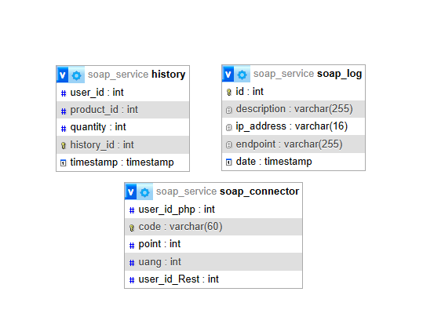

# SOAP Service

# SOAP Service Documentation

## Description
This repository is dedicated to a SOAP-based web service designed primarily for facilitating point top-up functionality. Users can increase their points via this service. Additionally, this SOAP service incorporates a feature enabling users to purchase merchandise using their accumulated points.

## Database

The above scheme consists of 3 tables. The history table is used to store merch purchase history on rest. The soap log table is used to do logging if a feature on soap is used. The soap connector table is used to store several attributes related to rest, soap and php. Examples are code and points.

## Endpoint
1. /topup
2. /code
3. /buyProduct
4. /checkCode
5. /getCurrency
6. /getHistory
7. /uangConverter
8. /getCode
9. /updatePoint

## Explanation
/topup: This endpoint facilitates the process of adding points or credits to a user's account. It typically accepts requests containing user identification and the amount of points to be added. Upon successful execution, it updates the user's points balance.

/code: The endpoint handles a specific action related to generating or managing authentication or access codes. It involve functionalities like generating unique codes.

/buyProduct: The '/buyProduct' endpoint allows users to purchase products or items offered by the service. It usually expects a request with details regarding the product ID, quantity, and possibly user authentication for completing the purchase transaction.

/checkCode: This endpoint is responsible for validating or verifying a register code.

/getCurrency: The endpoint retrieves information related to currency details, such as point and money. 

/getHistory: The '/getHistory' endpoint retrieves the transaction or usage history associated with a user's account. It could provide details like past purchases, points usage, or transaction logs based on user identification.

/uangConverter: This endpoint handles currency conversion functionalities. It convert money to point.

/getCode: The '/getCode' endpoint retrieves specific codes or access tokens based on provided criteria or identifiers. It return codes required for authentication register code.

/updatePoint: The '/updatePoint' endpoint is responsible for modifying or updating a user's points or credit balance. It typically receives requests with details like user identification and the amount of points to be added, deducted, or adjusted.

### Assignment
|Feature|13521015|13521025|
|-------|--------|--------|
|topup||✔️|
|code||✔️|
|buyProduct||✔️|
|checkCode||✔️|
|getCurrency||✔️|
|getHistory||✔️|
|uangConverter||✔️|
|getCode||✔️|
|updatePoint||✔️|
|testing|✔️|✔️|
